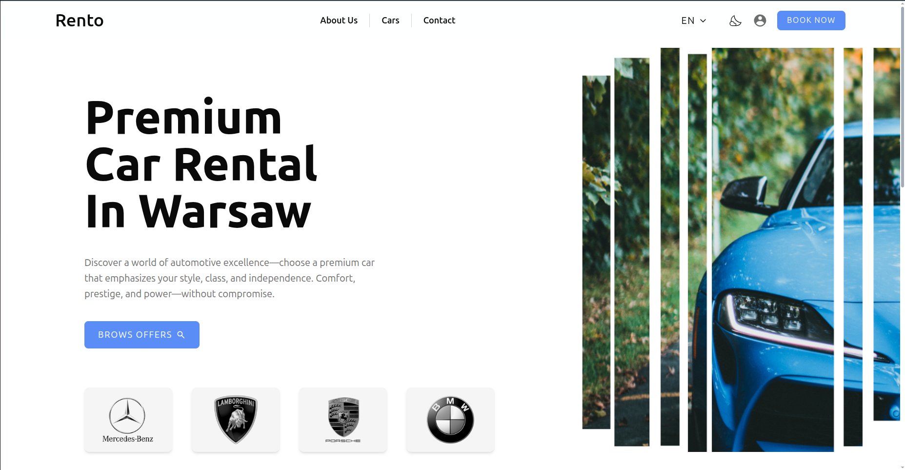
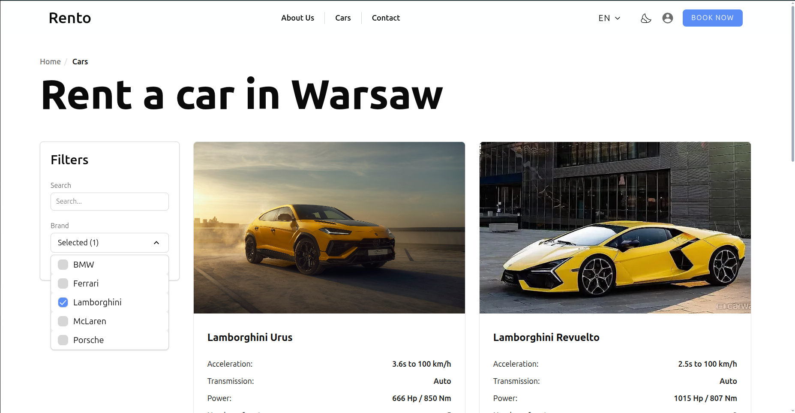
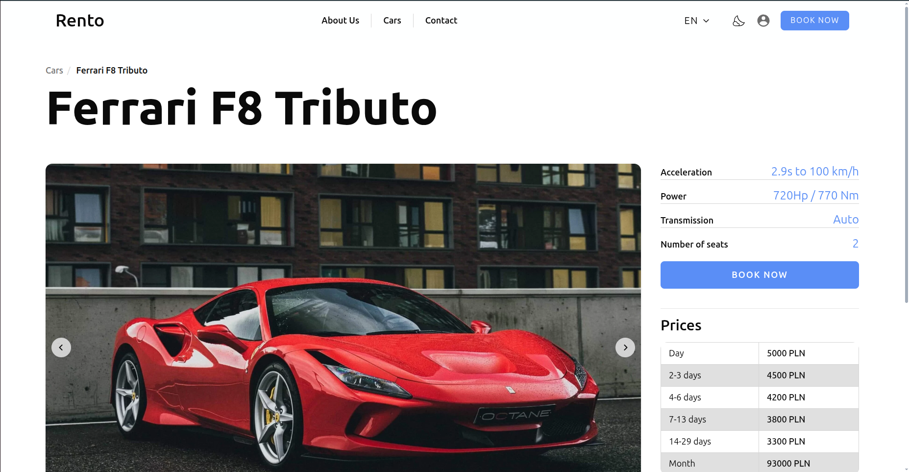
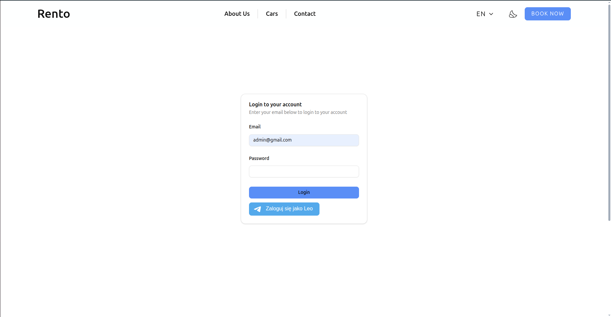
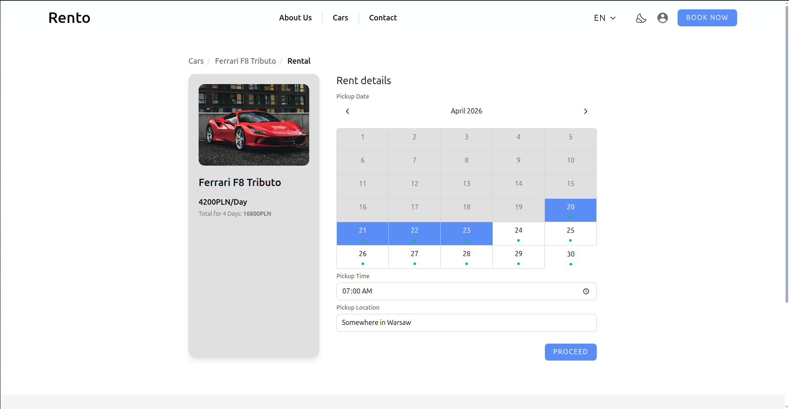
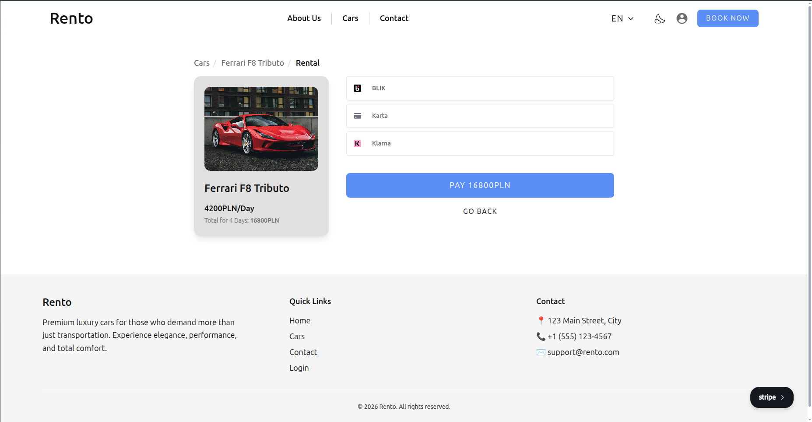
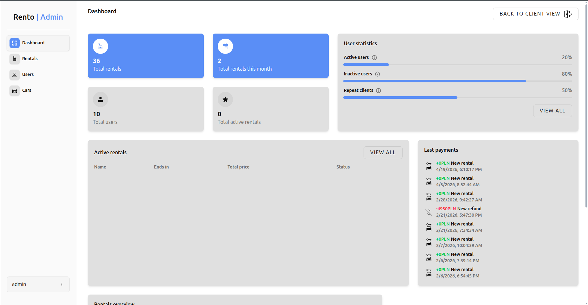
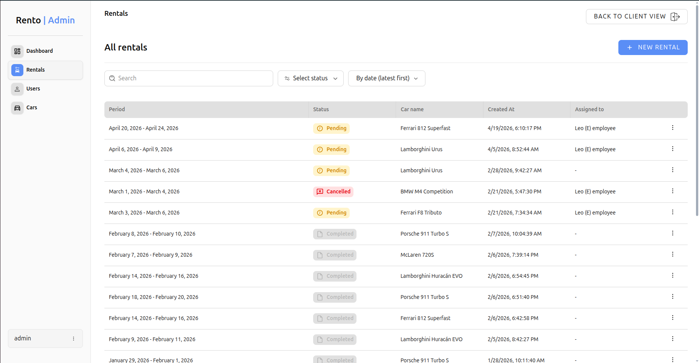
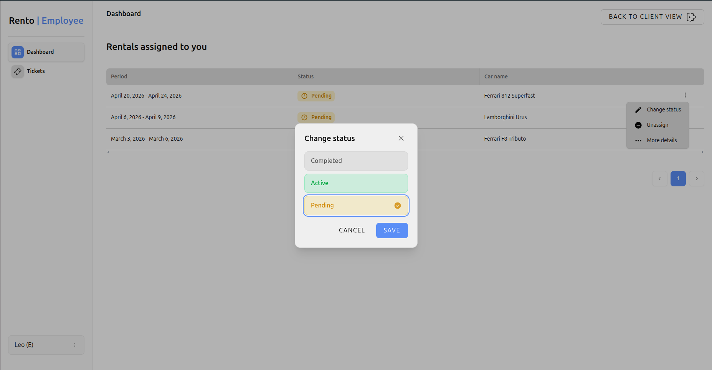

# Rento

Rento is a software application that allows users to browse available cars, make reservations, and manage rentals through a digital system.

<p align="center">
  
  
  
  
  
  
  
  
  

</p>

---

## 🌟 Accessabilities

#### 👨🏻‍💼 Client:

Clients use the system to browse and rent vehicles. Their available functionalities include:

- Browsing and renting available cars
- Checking real-time vehicle availability
- Viewing personal rental history
- Managing and updating their personal profile information

#### 💼 Employee:

Employees are responsible for operational rental management and customer support. Their functionalities include:

- Viewing rentals assigned to them
- Accessing and managing customer support tickets
- Viewing detailed information about rental orders
- Updating rental statuses (e.g., active, completed, cancelled)

#### 🛡️ Administrator

Administrators have full system control and are responsible for managing the platform. Their functionalities include:

- Full CRUD (Create, Read, Update, Delete) management of:
    - Rentals
    - Users
    - Cars
- Viewing dashboard with statistics

---

## 🌟 Technology stack

#### Frontend

- Vue 3
- Vue Router
- Pinia
- Vite

**Styling:** Tailwind CSS, Shadcn/ui (Vue port)

**Forms:** Vuelidate

**Data Fetching / Server State:** Axios, TanStack Vue Query

**Payments:** Stripe

**Charts:** Apexcharts

**Localization:** Vue i18n

**Icons:** Lucide, Iconify

#### Backend

- Nest.js
- REST API
- MongoDB
- Mongoose
- JWT
- Cloudinary
- Stripe

---

## 📑 Architecture

Project follows Feature-Sliced Design architecture

```
src/
 ├─ app/ # Router, providers, etc.
 │   ├─ layouts/
 │   ├─ router/
 │   └─ App.vue
 │
 ├─ pages/ # Represents different views
 │   ├─ account/
 │   ├─ rentals/
 │   ├─ cars/
 │   └─ adminEditRental/
 │
 ├─ widgets/ # Combines entities and features
 │   ├─ editCar/
 │   ├─ adminSidebar/
 │   └─ navbar/
 |
 ├─ features/ # What user can do
 │   ├─ editCar/
 │   ├─ booking/
 │   |─ changeStatus/
 |   └─ sortUsers/
 |
 ├─ entities/ # Domain data
 │   ├─ practice-quiz/
 │   ├─ create-quiz/
 │   └─ auth/
 |
 ├─ shared/ # Shared data (configs, ui, etc.)
 │   ├─ config/
 │   ├─ lib/
 │   └─ ui/
```

---

## 🔐 Authentication & Authorization

- JWT-based authentication (or Telegram)
- Role-based access control (RBAC)
- Secure password hashing

---

## ⚡ Run Locally

Clone the project

```bash
  git clone https://github.com/karal63/Rento.git rento/
```

Go to the client directory

```bash
  cd rento
```

Install dependencies

```bash
  npm install
```

Start the server

```bash
  npm run dev
```

App is running now on [http://localhost:5173](http://localhost:5173)

---

## 🧪 Testing

Run all unit tests

```bash
npm run test:unit
```

Run all e2e tests

```bash
npm run test:e2e
```

**Testing tools:**

- Jest / Vitest
- Playwright

---

## 🌐 API Documentation

For full API documentation navigate to [http://localhost:2000/api/docs](http://localhost:2000/api/docs)

---

## 💡 Future ideas

- Implement discounts
- Contact feature

---

## ✍️ Project Objectives

This project was developed to demonstrate:

- Understanding of modern web application architecture
- Implementation of a Role-Based Access Control (RBAC) system
- Practical usage of TanStack Query
- Designing and implementing a scalable and maintainable project structure
- Working with containerized environments using Docker
- Implementation of a MongoDB and mongoose
